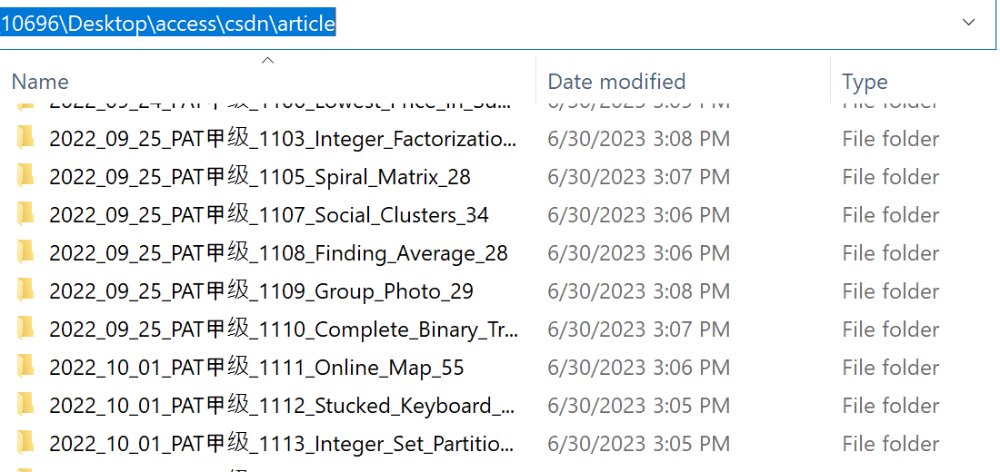
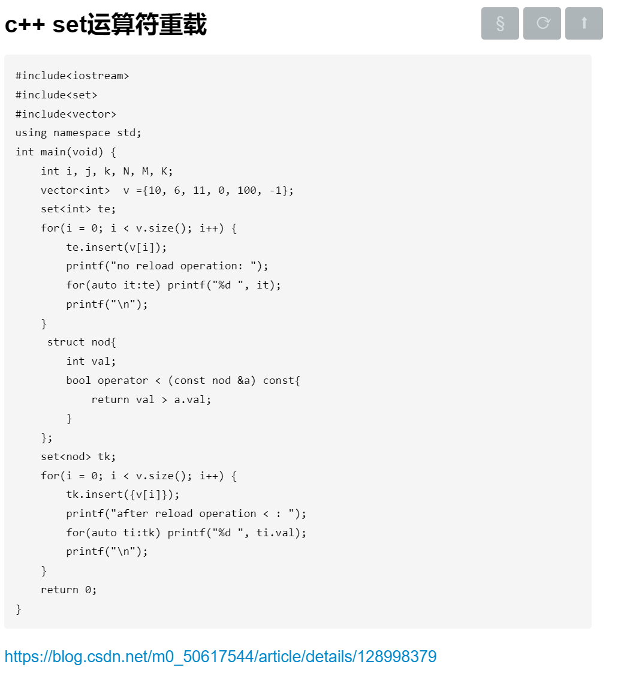
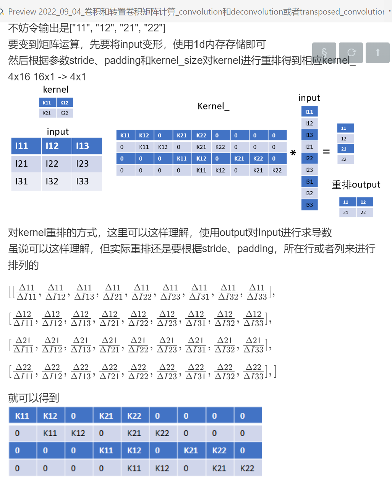
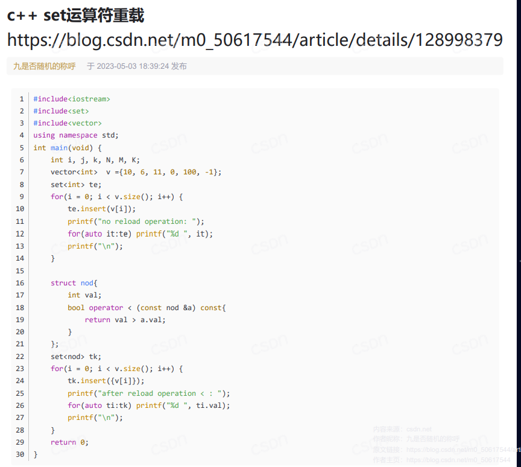
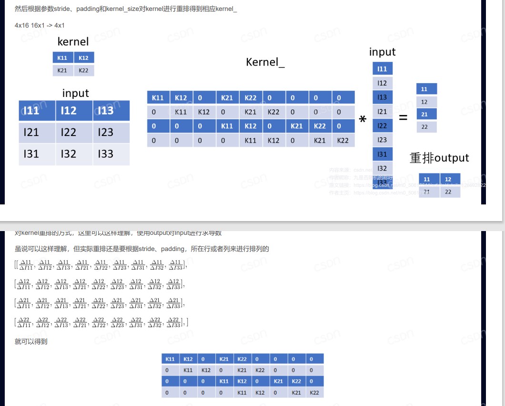
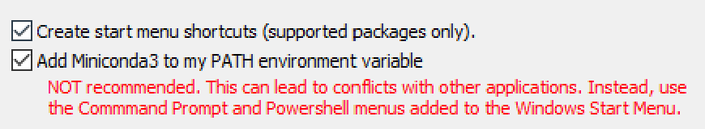
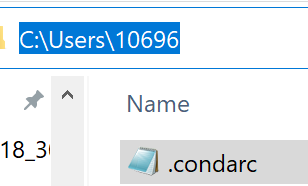
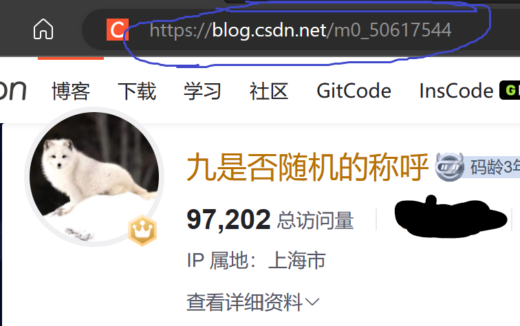
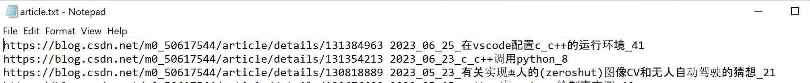

# 爬取CSDN的内容
考虑到将写的内容爬取下来，保存起来的避免误删，算是个备份的，而且方便查找，阅读起来也更方便，使用起来也好很多 
 
## 亮点
保存**article**到**pdf**、**markdown**，并保存相应的图片、codes以及website，排版基本按照网页，**支持保存数学公式到markdown**

### 爬取到的article展示
<a href="./article">点击即可进入article目录查看的</a>    
每篇article都附带了修改时间和阅读数   

<b>保存到Markdown格式的数学公式、codes和图片</b>   
<a href="https://blog.csdn.net/m0_50617544/article/details/128998379">c++ set运算符重载</a>   
<a href="https://blog.csdn.net/m0_50617544/article/details/126692822">卷积和转置卷积矩阵计算</a>    
    

<b>保存到PDF格式的，标题下面是网址</b>    

## 环境以及安装
**win10** **python**

1、点击下面这个网页，安装miniconda也就是安装python，下载好以后安装即可，在安装时需要加入到系统环境变量，勾选下图第二个框即可。   
 [https://mirrors.tuna.tsinghua.edu.cn/anaconda/miniconda/Miniconda3-py310_23.3.1-0-Windows-x86_64.exe](https://mirrors.tuna.tsinghua.edu.cn/anaconda/miniconda/Miniconda3-py310_23.3.1-0-Windows-x86_64.exe)
    
2、接着需要修改python安装的路径，将msedgedriver\\.condarc这个档案放到根目录`C:\Users\username`即可，另外再打开一个cmd或者PowerShell
运行`conda clean -i`输入`Y`即可，此时Python已经可以使用了   
   
3、安装Python相关的调用库，另外再打开一个cmd或者PowerShell，运行   
<code>cd C:\Users\usrname\csdn     
pip install -r .\requirement.txt</code>    

## 使用
### 1、登录
进入个人主页，先点击**个人中心**，然后点击**个人主页**，拿到个人主页的网址即可，像这里的个人地址是<a href="https://blog.csdn.net/m0_50617544">https://blog.csdn.net/m0_50617544</a>，然后加上后缀就是<b><a href="https://blog.csdn.net/m0_50617544?type=blog">https://blog.csdn.net/m0_50617544?type=blog</a></b>，用到的网址是后面这个   

运行以下内容，网址需要用个人的替掉，这一步是**手动**操作，需要人工输入账号和密码，然后点击登录就行，登录以后会自动保存好cookie，以后爬取时就不用重复登录了，保存的cookie在这个目录的**cookie**，产生的档案是**cookie_csdn.pkl**    
 <h6><code><b style="color:#7a3e9d;">python.exe crawler.py --csdn_person_website https://blog.csdn.net/m0_50617544?type=blog</b></code></h6>    
运行以后会弹出一个浏览器，自动打开CSDN页面以后就可以开始登录，下图所示就是登录页面，三类登录方式都可以，只要能登录就行，<a style="color:black;"><b>点击登录以后，不要再操作页面，键盘或鼠标都不可以，登录时间默认给了130s时间，130秒以后会自动退出，然后查看目录cookie是否保存好cookie_csdn.pkl，保存好就可以开始爬取了。</b></a>
 

### 2、爬取article  
爬取一旦开始就自动运行了，爬取窗口一般不能最小化，可以做其他事情的   
**爬取CSDN的article**   
默认的爬取每篇article的睡眠时间是**20s**以上，这边实际爬取时耗时平均是每篇 **60s**，每个图片需要6s   
`
python.exe crawler.py --article --csdn_person_website https://blog.csdn.net/m0_50617544?type=blog
`

### 又发布了一篇，只爬取写的这篇
第一次可以全部爬取，等所有article都已经爬取好以后，此时若是又写了一篇或者几篇article，而且想爬取到本地，可以将<b>article/article.txt</b>这个档案重命名到<b>article/article_2023_06_20.txt</b>，然后将写好的article的网址和标题按照之前档案的格式再create一个article.txt档案，运行爬取程序就可以了的，此时只会爬取article.txt的网址
 
若是过了很长时间，发布了很多篇，此时一篇一篇加入不太方便，可以直接将<b>article/article.txt</b>这个档案重命名到<b>article/article_2023_06_20.txt</b>，然后运行爬取程序即可，上面提到了已经爬取过的不会重复爬取，所以实际只会爬取最近写好的article。

### 目录
<b>article</b>：该目录存放article的website以及爬取到的内容

### 爬取注意事项
1、需要较好的网速，本机网速测验是下载100Mbps，上传60Mbps，低点也可以的，不是太慢太卡就行[https://www.speedtest.cn/](https://www.speedtest.cn/)
2、爬取时设置了睡眠时间, 避免给CSDN服务器带来太大压力，可以日间调试好，然后深夜运行爬取人少, 给其他小伙伴更好的用户体验, 避免CSDN顺着网线过来找人，默认**6**s

### blogs
[https://www.aliyundrive.com/s/NikyVRJq8JV   阿里云分享的](https://www.aliyundrive.com/s/NikyVRJq8JV) `提取  0h3l`  
[爬取知乎发布的想法和文篇和回答](https://zhuanlan.zhihu.com/p/641141948) 
[爬取CSDN发布的文篇](https://zhuanlan.zhihu.com/p/641140892) 
[https://zoujiu.blog.csdn.net/article/details/131514422](https://zoujiu.blog.csdn.net/article/details/131514422) 
[https://zoujiu.blog.csdn.net/article/details/131521909](https://zoujiu.blog.csdn.net/article/details/131521909) 
