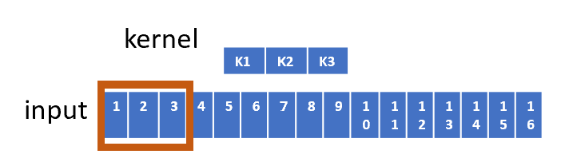

# 卷积和转置卷积矩阵计算 convolution和deconvolution或者transposed_convolution

总的来说[卷积计算](https://so.csdn.net/so/search?q=%E5%8D%B7%E7%A7%AF%E8%AE%A1%E7%AE%97&spm=1001.2101.3001.7020)是多对一，也就是多个input，和所有kernel进行multiply+add，通道channel方向也进行add，得到一个数字。转置卷积或者说是逆卷积，是一对多的关系，是一个input和所有kernel进行multiply，通道channel方向才进行add，得到kernel_size_width*kernel_size_height个数字
  
​
  
  
​

# 1d的卷积计算
即滑窗运算，卷积核kernel和Input的位置[multiply](https://so.csdn.net/so/search?q=multiply&spm=1001.2101.3001.7020)然后add， K1*1 + K2*2+K3*3 = out1
  
​Stride=2 K1*3+K2*4+K5*3 = out2
  

# ​2d的卷积计算 padding = 0， stride=1

### 

## 滑窗
CV computer vision里，卷积的运算通常使用滑窗的方式更好理解，像input等于3x3，stride=1，padding = 0, kernel_size = 2x2的卷积运算
  
​
输出大小计算方式是：
output_width = 1 + (width + 2 * padding_width - kernel_size_width)//stride
//是取整的意思
output_height = 1 + (height + 2 * padding_height - kernel_size_height)//stride
所以这里的输出大小是output_width = 1+(3+0*2-2)//1 = 2 output_height = 1+(3+0*2-2)//1 = 2 输出大小是2x2
  
​
  
滑窗的顺序和方向基本可以这样子，从左至右从上到下，在通道channel方向，输出是对应的location coordination进行累加运算，输入的通道数全部加完，就得到一个输出的特征图

### 

## 矩阵
滑窗运算虽然好理解，但很多在加速运算的时候，不会使用这样的方式，主要的原因是内存不连续，导致不能并行计算，像caffe，卷积计算方式就是将卷积变到矩阵运算，而矩阵运算有很多库实现了快速计算，像mblas等
2d卷积的矩阵运算方式，矩阵是有规律可循的，但是滑窗是不规则的，内存上是不连续的，矩阵可以连续存储，所以矩阵的计算可以在内存上连续进行
以上说的卷积 input等于3x3，stride=1，padding = 0, kernel_size = 2x2
不妨令输出是["11", "12", "21", "22"]
要变到矩阵运算，先要将input变形，使用1d内存存储即可
然后根据参数stride、padding和kernel_size对kernel进行重排得到相应kernel_
4x16 16x1 -> 4x1
  
​对kernel重排的方式，这里可以这样理解，使用output对Input进行求导数
虽说可以这样理解，但实际重排还是要根据stride、padding，所在行或者列来进行排列的

$[[\frac{\Delta11}{\Delta{I11}},\frac{\Delta11}{\Delta{I12}},\frac{\Delta11}{\Delta{I13}},\frac{\Delta11}{\Delta{I21}},\frac{\Delta11}{\Delta{I22}},\frac{\Delta11}{\Delta{I23}},\frac{\Delta11}{\Delta{I31}},\frac{\Delta11}{\Delta{I32}},\frac{\Delta11}{\Delta{I33}}],$  

$[\frac{\Delta12}{\Delta{I11}},\frac{\Delta12}{\Delta{I12}},\frac{\Delta12}{\Delta{I13}},\frac{\Delta12}{\Delta{I21}},\frac{\Delta12}{\Delta{I22}},\frac{\Delta12}{\Delta{I23}},\frac{\Delta12}{\Delta{I31}},\frac{\Delta12}{\Delta{I32}},\frac{\Delta12}{\Delta{I33}}],$  

$[\frac{\Delta21}{\Delta{I11}},\frac{\Delta21}{\Delta{I12}},\frac{\Delta21}{\Delta{I13}},\frac{\Delta21}{\Delta{I21}},\frac{\Delta21}{\Delta{I22}},\frac{\Delta21}{\Delta{I23}},\frac{\Delta21}{\Delta{I31}},\frac{\Delta21}{\Delta{I32}},\frac{\Delta21}{\Delta{I33}}],$  

$[\frac{\Delta22}{\Delta{I11}},\frac{\Delta22}{\Delta{I12}},\frac{\Delta22}{\Delta{I13}},\frac{\Delta22}{\Delta{I21}},\frac{\Delta22}{\Delta{I22}},\frac{\Delta22}{\Delta{I23}},\frac{\Delta22}{\Delta{I31}},\frac{\Delta22}{\Delta{I32}},\frac{\Delta22}{\Delta{I33}}],]$  
就可以得到
  
​

# 卷积padding = 1, stride = 2

### 

## 滑窗
input等于3x3，stride=2，padding = 1, kernel_size = 2x2的卷积运算
根据前面的计算公式，这里的输出大小是output_width = 1+(3+1*2-2)//2 = 2 output_height = 1+(3+1*2-2)//2 = 2 输出大小是2x2
  
​
  
  
​
  

### 

## 矩阵
由于stride = 2, padding=1, 所以kernel展开的时候要考虑所在的行或者列，以及padding和stride，此时的输入也变到了after padding的input_，计算的公式可以显示出最后的输出仍然是2x2，但计算经过完全不同了
4x25 25x1 -> 4 x1
  
​
  

# 多个channel的卷积矩阵运算
当不止一个channel进行卷积运算时，像input3x3x9，stride=1，padding = 0, kernel_size = 2x2x9
这里的9就是channel数
此时的滑窗方式就要在channel方向同时进行了，相同的location coordination进行累加即可
  
​
关于矩阵此时也可以使用，不过此时的矩阵长和宽都会大很多，主要是kernel矩阵进行了列扩充，以及input矩阵进行了行扩充，最后的输出仍然是2x2
kernel列方向扩充了kernel, 【kernel_channel1<->kernel_channel2<->kernel_channel3<->......】
input矩阵在行方向扩充了 $[input\_channel1, input\_channel2, input\_channel3, ......]^T$  
  

# ​[转置卷积](https://so.csdn.net/so/search?q=%E8%BD%AC%E7%BD%AE%E5%8D%B7%E7%A7%AF&spm=1001.2101.3001.7020)或者逆卷积 stride=1，padding = 0
transposed_convolution 2d or deconvolution， 是一对多的关系，channel方向的计算仍然是累加
虽然是被叫做转置卷积，但并不能通过转置卷积得到先前的特征图，这里以上面的Output 2x2 作为转置卷积的输入
转置卷积要计算两次输出，一次是临时输出，另一次是去除掉padding以后的输出
第一次临时输出的大小计算公式：
tmp_out_width = (input_width - 1) * stride + kernel_width
tmp_out_height = (input_height - 1)*stride + kernel_height
实际输出的大小计算公式，也就是卷积计算公式的逆求解
out_width = tmp_out_width - 2*padding_width = (input_width - 1) * stride + kernel_width - 2*padding_width
out_height =tmp_out_height - 2*padding_height = (input_height - 1)*stride + kernel_height - 2*padding_height
input等于2x2，stride=1，padding = 0, kernel_size = 2x2
tmp_out_width = (2-1)*1+2 = 3; tmp_out_height = (2-1)*1+2=3
out_width = (2-1)*1+2-0*2=3; out_height = (2-1)*1+2-0*2=3;
这里的tmp_out_width和out_width，以及tmp_out_height和out_height，相等的原因是padding=0
这里首先进行内存malloc， 大小是tmp_out_width X tmp_out_height，若是存在偏置bias, 则要进行初始化
这里令bias= 0 ,也就是不存在偏置，以0初始化临时输出

## 滑窗
这里的计算是一对多，由于stride= 1，所以累加的时候就会出现同个位置多个数值相加
padding = 0, 所以cut_padding的步骤可以省略，输出大小是3x3
  

## 矩阵
卷积的矩阵运算是Kernel x input = output， 转置卷积顾名思义，将kernel进行转置然后multiply到右侧即可
也就是input = * output, 由于output作为这里的输入，所以可以写作output' = = * input'
这里的转置卷积运算的左侧矩阵是卷积运算左侧矩阵的转置，所以叫做转置矩阵，但当stride!=1或者padding!=0时，就有些不同的地方，可能不完全是转置
  

# ​转置的卷积padding = 1, stride = 2
input等于2x2，stride=2，padding = 1, kernel_size = 2x2
tmp_out_width = (2-1)*2+2 = 4; tmp_out_height = (2-1)*2+2=4
out_width = (2-1)*1+2-1*2=2; out_height = (2-1)*1+2-1*2=2;

### 

## 滑窗
这里的计算是一对多，由于stride= 2，kernel_size=2x2，所以累加的时候不会出现重叠的现象，但若是kernel_size=3x3，那么就会出现重叠的现象，此时要进行多个数值累加
padding = 1, 所以cut_padding，输出大小是2x2  
这里要进行cut_padding，padding=1x1，所以上侧、下侧、左侧和右侧都要去掉1个格子，输出是2x2
  
​

## 矩阵
这里的Kernel要根据输出的临时特征图4x4，以及stride和padding进行重排顺序，input仍然是1d向量，最后就可以进行矩阵运算，然后cut_padding，得到最后输出2x2
这里和上面的区别在，左侧的矩阵是16x4，并不是25x4，所以当stride!=1, padding!=0时还是存在些区别的
并不完全是转置，转置卷积的kernel重排主要还是要看输出临时特征图的大小来决定
  
多个channel的转置卷积矩阵运算，和卷积矩阵运算基本类似，可以和之前的对照 

##  总结：
卷积和转置卷积都可以使用滑窗的方式来理解，实际使用也可以这样写codes，这两者也都可以用矩阵运算来实现，加速的实现使用矩阵运算来加速，转置卷积矩阵重排的方式实际要看临时输出矩阵的大小、stride以及padding。
 

[https://blog.csdn.net/m0_50617544/article/details/126692822](https://blog.csdn.net/m0_50617544/article/details/126692822) 

