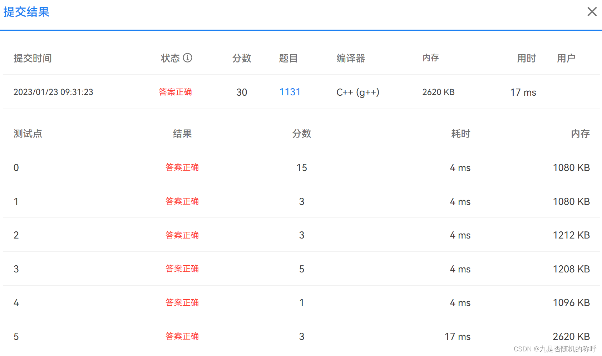
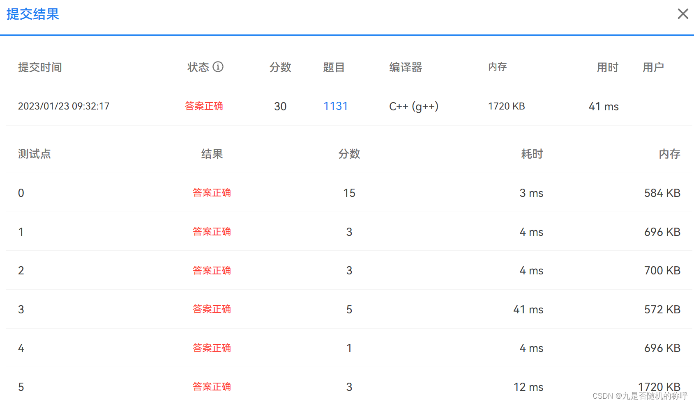

# PAT甲级 1131 Subway Map

堆优化
<br>
```
#include<iostream>
#include<vector>
#include<algorithm>
#include<queue>
#include<unordered_map>
using namespace std;
typedef pair<int, int> p;
p r0, r1, r2;
vector<int> pth[10006], tmp, res;
vector<p> v[10006], lne[10006];
unordered_map<unsigned int, unsigned int> ump;
int inf = 999999999, status[10006];
int tat, ending, minmin = inf, transfnum;
int get_transfnum() {
    int num = 0, pre = 0;
    for(int i = 1; i < tmp.size(); i++) {
        if(ump[tmp[i] * 10000 + tmp[i-1]] != pre) num++;
        pre = ump[tmp[i] * 10000 + tmp[i-1]];
    }
    return num;
}
void recursion(int edi) {
    tmp.push_back(edi);
    if(tat==edi) {
        transfnum = get_transfnum();
        if(transfnum < minmin){
            minmin = transfnum;
            res = tmp;
        }
        tmp.pop_back();
        return;
    }
    vector<int> kk = pth[edi];
    for(int i = 0; i < pth[edi].size(); i++) {
        recursion(pth[edi][i]);
    }
    tmp.pop_back();
}
int main(void) {
    int i, j, k, m, n, N, M, T, pre, ditance[10006], x, y, z;
    cin>>N;
    for(i = 1; i <= N; i++) {
        cin>>T;
        for(j = 0; j < T; j++) {
            cin>>m;
            if(j!=0) {
                r0.first = 1;
                r0.second = m;
                v[pre].push_back(r0);
                r0.second = pre;
                v[m].push_back(r0);
                 ump[pre * 10000 + m] = ump[m * 10000 + pre] = i;
            }
            pre = m;
        }
    }
    cin>>M;
    for(i = 0; i < M; i++) {
        cin>>tat>>ending;
        fill(status, status + 10006, 0);
        fill(ditance, ditance + 10006, inf);
        ditance[tat] = 0;
        priority_queue<p, vector<p>, greater<p>> pq;
        r0.first = 0;
        r0.second = tat;
        pq.push(r0);
        while(!pq.empty()) {
            r0 = pq.top();
            pq.pop();
            x = r0.second;
            if(status[x]==1) continue;
            status[x] = 1;
            for(j = 0; j < v[x].size(); j++) {
                y = v[x][j].second;
                k = v[x][j].first;
                if(status[y]==0 && ditance[y] > ditance[x] + k) {
                    ditance[y] = ditance[x] + k;
                    pq.push({ditance[y], y});
                    pth[y].clear();
                    pth[y].push_back(x);
                } else if(status[y]==0 && ditance[y] == ditance[x] + k) {
                    pth[y].push_back(x);
                }
            }
        }
        tmp.clear();
        minmin = inf;
        fill(status, status + 10006, 0);
        recursion(ending);
        int preline=0, nowline=9;
        vector<int> tp, lk;
        reverse(res.begin(), res.end());
        for(j = 1; j < res.size(); j++) {
            nowline = ump[res[j] * 10000 + res[j - 1]];
            if(preline!=nowline) {
                tp.push_back(res[j - 1]);
                lk.push_back(nowline);
            }
            preline = nowline;
        }
        tp.insert(tp.end(), res[res.size() - 1]);
        lk.insert(lk.end(), nowline);
        printf("%d\n", res.size() - 1);
        for(j = 0; j < tp.size() - 1; j++) {
            printf("Take Line#%d from %04d to %04d.\n", 
                    lk[j], tp[j], tp[j+1]);
        }
    }
    return 0;
}
```
<br>   update2
<br>
```
#include<iostream>
#include<vector>
#include<unordered_map>
#include<algorithm>
using namespace std;
unordered_map<int, int> ump;
vector<int> v[10006], tmp, res;
int inf = 999999999, status[10006];
int starts, ending, transfnum, numnode, shift = 10000;
int gettransf() {
    int preline = 0, num = 0, tpl;
    for(int i = 1; i < tmp.size(); i++) {
        tpl = ump[tmp[i] * shift + tmp[i-1]];
        if(preline!=tpl) num++;
        preline = tpl;
    }
    return num;
}
void recursion(int st) {
    if(st == ending && tmp.size() <= numnode) {
        int num_transf = gettransf();
        if(tmp.size() < numnode || 
            (tmp.size()==numnode && num_transf < transfnum)) {
            transfnum = num_transf;
            numnode = tmp.size();
            res = tmp;
        }
        return;
    }
    for(int i = 0; i < v[st].size(); i++) {
        int pt = v[st][i]; // local variable
        if(status[pt]==1) continue;
        status[pt] = 1;
        tmp.push_back(pt);
        recursion(pt);
        tmp.pop_back();
        status[pt] = 0;
    }
}
int main(void) {
    int i, j, k, m, n, y, z, pre;
    cin>>m;
    for(i = 1; i <= m; i++) {
        cin>>n;
        for(j=0; j < n; j++) {
            cin>>y;
            if(j > 0) {
                ump[pre * shift + y] = ump[y * shift + pre] = i;
                v[y].push_back(pre);
                v[pre].push_back(y);
            }
            pre = y;
        }
    }
    cin>>n;
    for(i = 0; i < n; i++) {
        cin>>starts>>ending;
        tmp.clear();
        tmp.push_back(starts);
        transfnum = numnode = inf;
        fill(status, status + 10006, 0);
        recursion(starts);
        vector<int> vrnode, vrline;
        int preline = -1, nowline = -2;
        for(j = 1; j < res.size(); j++) {
            nowline = ump[res[j] * shift + res[j - 1]];
            if(nowline!=preline) {
                vrnode.push_back(res[j - 1]);
                vrline.push_back(nowline);
            }
            preline = nowline;
        }
        vrnode.push_back(res[res.size() - 1]);
        vrline.push_back(nowline);
        printf("%d\n", res.size() - 1);
        for(j = 0; j < vrnode.size() - 1; j++) {
            printf("Take Line#%d from %04d to %04d.\n", 
                vrline[j], vrnode[j], vrnode[j+1]);
        }
    }
    return 0;
}
```
<br>  
update20230225  recursion
<br>
```
#include<iostream>
#include<vector>
#include<unordered_map>
#include<algorithm>
using namespace std;
unordered_map<int, int> ump;
vector<int> res, tmp, route[10006];
int status[10006], start, endkk, mintra, mindik;
int gettransfer() {
    int num = 0, pretran = 0;
    for(int i = 0; i < tmp.size(); i++) {
        if(i > 0) {
            if(pretran!=ump[tmp[i-1]*10000 + tmp[i]]) num++;
            pretran = ump[tmp[i-1]*10000 + tmp[i]];
        }
    }
    return num;
}
void recursion(int station) {
    if(station == endkk) {
        int num = gettransfer();
        if(tmp.size() < mindik || (tmp.size()==mindik && num < mintra)) {
            mindik = tmp.size();
            mintra = num;
            res = tmp;
        }
        return;
    }
    for(int i = 0; i < route[station].size(); i++) {
        int kk = route[station][i];
        if(status[kk] == 0) {
            status[kk] = 1;
            tmp.push_back(kk);
            recursion(kk);
            tmp.pop_back();
            status[kk] = 0;
        }
    }
}
int main(void) {
    int i, j, k, m, n, N, M, K, x, y, z, cnt, pre;
    cin>>N;
    for(i = 1; i <= N; i++) {
        cin>>M;
        for(j = 1; j <= M; j++) {
            cin>>y;
            if(j > 1) {
                ump[pre * 10000 + y] = ump[y * 10000 + pre] = i;
                route[pre].push_back(y);
                route[y].push_back(pre);
            }
            pre = y;
        }
    }
    cin>>K;
    for(i = 0; i < K; i++) {
        cin>>start>>endkk;
        tmp.clear();
        res.clear();
        tmp.push_back(start);
        mintra = mindik = 999999999;
        fill(status, status + 10006, 0);
        status[start] = 1;
        recursion(start);
        printf("%d\n", res.size() - 1);
        int pretra = ump[res[0] * 10000 + res[1]], now = res[0];
        for(j = 1; j < res.size(); j++) {
            if(pretra != ump[res[j - 1] * 10000 + res[j]]) {
                printf("Take Line#%d from %04d to %04d.\n", pretra, now, res[j-1]);
                now = res[j - 1];
            }
            pretra = ump[res[j-1]*10000 + res[j]];
        }
        printf("Take Line#%d from %04d to %04d.\n", pretra, now, res[j-1]);
    }
    return 0;
}
```
<br>update20230225  [priority_queue](https://so.csdn.net/so/search?q=priority_queue&spm=1001.2101.3001.7020)heapify Dijkstra
<br>
```
#include<iostream>
#include<queue>
#include<vector>
#include<algorithm>
#include<unordered_map>
using namespace std;
typedef pair<int, int> p;
int status[10006], mintra, start, endkk, dik[10006], inf = 999999999;
vector<int> route[10006], tmp, res;
unordered_map<int, int> ump;
int gettranfer() {
    int num = 0, pretra = 0;
    for(int i = 0; i < tmp.size(); i++) {
        if(i > 0) {
            if(pretra != ump[tmp[i-1] * 10000 + tmp[i]]) num++;
        }
        pretra = ump[tmp[i-1] * 10000 + tmp[i]];
    }
    return num;
}
void recursion(int station) {
    tmp.push_back(station);
    if(station==start) {
        int num = gettranfer();
        if(mintra > num) {
            res = tmp;
            mintra = num;
        }
        tmp.pop_back();
        return;
    }
    for(int i = 0; i < route[station].size(); i++) {
        recursion(route[station][i]);
    }
    tmp.pop_back();
}
int main(void) {
    int i, j, k, m, n, N, M, K, x, y, z, pre;
    priority_queue<p, vector<p>, greater<p>> pq;
    p p0, p1, p2;
    vector<p> v[10006];
    cin>>N;
    for(i = 1; i <= N; i++) {
        cin>>M;
        for(j = 0; j < M; j++) {
            cin>>y;
            if(j > 0) {
                v[y].push_back({1, pre});
                v[pre].push_back({1, y});
                ump[pre * 10000 + y] = ump[y * 10000 + pre] = i;
            }
            pre = y;
        }
    }
    cin>>K;
    for(i = 0; i < K; i++) {
        cin>>start>>endkk;
        fill(status, status + 10006, 0);
        fill(dik, dik + 10006, inf);
        mintra = inf;
        dik[start] = 0;
        pq.push({0, start});
        while(!pq.empty()) {
            p0 = pq.top();
            x = p0.second;
            pq.pop();
            if(status[x] == 1) continue;
            status[x] = 1;
            for(j = 0; j < v[x].size(); j++) {
                p1 = v[x][j];
                y = p1.second;
                z = p1.first;
                if(status[y] == 0 && dik[y] > dik[x] + z) {
                    dik[y] = dik[x] + z;
                    pq.push({dik[y], y});
                    route[y].clear();
                    route[y].push_back(x);
                } else if(status[y] == 0 && dik[y] == dik[x] + z) {
                    route[y].push_back(x);           
                }
            }
        }
        tmp.clear();
        recursion(endkk);
        reverse(res.begin(), res.end());
        printf("%d\n", res.size() - 1);
        int pretra = ump[res[0] * 10000 + res[1]], now=res[0];
        for(j = 1; j < res.size(); j++) {
            if(pretra!=ump[res[j]*10000 + res[j-1]]) {
                printf("Take Line#%d from %04d to %04d.\n", pretra, now, res[j-1]);
                now = res[j-1];
            }
            pretra = ump[res[j]*10000 + res[j-1]];
        }
        printf("Take Line#%d from %04d to %04d.\n", pretra, now, res[j-1]);
    }
    return 0;
}
```
<br>update 
<br>
```
#include<iostream>
#include<vector>
#include<unordered_map>
#include<algorithm>
using namespace std;
unordered_map<int, int> ump;
vector<int> v[10006], tmp, res;
int starts, endst, minmin = 999999999, quick = 999999999; 
int status[10006];
int gettransf() {
    int preline = 0, z, cnt = 0;
    for(int i = 1; i < tmp.size(); i++) {
        z = ump[tmp[i-1]*10000 + tmp[i]];
        if(preline!=z) cnt++;
        preline = z;
    }
    return cnt;
}
void recursion(int st) {
    if(endst==st && tmp.size() <= quick) {
        int num_transf = gettransf();
        if(tmp.size() < quick||
        (tmp.size() == quick && minmin > num_transf)) {
            res = tmp;
            minmin = num_transf;
            quick = tmp.size();
        }
        return;
    }
    status[st]=1;
    vector<int> small = v[st];
    for(int i = 0; i < small.size(); i++) {
        if(status[small[i]]==1) continue;
        tmp.push_back(small[i]);
        status[small[i]]=1;
        recursion(small[i]);
        tmp.pop_back();
        status[small[i]]=0;
    }
}
int main(void){
    int i, j, k, m, n, y, z, pre;
    cin>>m;
    for(i = 0; i < m; i++) {
        cin>>n;
        for(j=0; j < n; j++) {
            cin>>y;
            if(j > 0) {
                ump[pre * 10000 + y] = ump[y*10000 + pre] = i+1;
                v[pre].push_back(y);
                v[y].push_back(pre);
            }
            pre = y;
        }
    }
    cin>>n;
    for(i = 0; i < n; i++) {
        cin>>starts>>endst;
        fill(status, status+10006, 0);
        tmp.clear();
        minmin = 999999999;
        quick = 999999999;
        tmp.push_back(starts);
        recursion(starts);
        printf("%d\n", res.size() - 1);
        int preline = 0, pretransf = starts;
        for(j = 1; j < res.size(); j++) {
            z = ump[res[j-1]*10000+res[j]];
            if(z!=preline){
                if(preline!=0) printf("Take Line#%d from %04d to %04d.\n", 
                                        preline, pretransf, res[j-1]);
                preline = z;
                pretransf = res[j-1];
            }
        }
        printf("Take Line#%d from %04d to %04d.\n", preline, pretransf, res[j-1]);
    }
    return 0;
}
```
<br>old before 
<br>
```
#include<iostream>
#include<vector>
#include<unordered_map>
#include<algorithm>
using namespace std;
int minmin, inf = 30000, query[11][2], start, endes, num;
bool status[9000];
unsigned char costes[9000];
unordered_map<int, int> ump, rev_ump, subway, all;
vector<vector<int>> route;
vector<int> pth, tmppth;
void recursion(int station) {
    tmppth.push_back(rev_ump[station]);
    if(station==ump[start]) {
        int pre = 0, cmn = 0;
        for(int j = 1; j < tmppth.size(); j++) {
            int sub = subway[ump[tmppth[j]]*10000+ump[tmppth[j-1]]];
            if(sub!=pre){
                pre = sub;
                cmn++;
            }
        }
        if(cmn < minmin) {
            minmin = cmn;
            pth = tmppth;
        }
    }
    for(int i = 0; i < route[station].size(); i++) {
        recursion(route[station][i]);
    }
    tmppth.pop_back();
}
int main(int argc, char **argv) {
    int i, j, k, m, n, y, z, cnt = 0, pre, begin, tailes;
    cin>>m;
    for(i = 0; i < m; i++) {
        cin>>n;
        for(j = 0; j < n; j++) {
            cin>>y;
            if(ump[y]==0) {
                rev_ump[cnt] = y;
                ump[y] = cnt++;
            }
            if(j >= 1) {
                all[pre*10000+ump[y]] = all[ump[y]*10000+pre] = 1;
                subway[pre*10000+ump[y]]=subway[ump[y]*10000+pre] = i+1;
            }
            pre = ump[y];
        }
    }
    cin>>m;
    for(k = 0; k < m; k++) {
        cin>>start>>endes;
        fill(status, status+9000, false);
        fill(costes, costes+9000, inf);
        costes[ump[start]] = 0;
        route.clear();
        route.resize(9000);
        for(i = 0; i < cnt; i++) {
            minmin = inf;
            for(j = 0; j < cnt; j++) {
                if(status[j]==false&&minmin > costes[j]) {
                    minmin = costes[j];
                    y = j;
                }
            }
            status[y] = true;
            for(j = 0; j < cnt; j++) {
                if(status[j]==false&&all[y*10000+j]!=0&&costes[j] > costes[y] + 1) {
                    costes[j] = costes[y] + 1;
                    route[j].clear();
                    route[j].push_back(y);
                }else if(status[j]==false&&all[y*10000+j]!=0&&costes[j] == costes[y] + 1) {
                    route[j].push_back(y);
                }
            }
        }
        minmin = inf;
        tmppth.clear();
        pth.clear();
        recursion(ump[endes]);
        reverse(pth.begin(), pth.end());
        printf("%d\n", pth.size() - 1);
        int pre = 0, pretransfer = start;
        for(int j = 1; j < pth.size(); j++) {
            if(subway[ump[pth[j-1]]*10000+ump[pth[j]]]!=pre) {
                if(pre!=0) printf("Take Line#%d from %04d to %04d.\n", pre, pretransfer, pth[j-1]);
                pre = subway[ump[pth[j-1]]*10000+ump[pth[j]]];
                pretransfer = pth[j-1];
            }
        }
        printf("Take Line#%d from %04d to %04d.\n", pre, pretransfer, endes);
    }
    return EXIT_SUCCESS;
}
```
<br>

[GitHub - ZouJiu1/PAT: 浙江大学PAT题目解答内容
浙江大学PAT题目解答内容. Contribute to ZouJiu1/PAT development by creating an account on GitHub.
https://github.com/ZouJiu1/PAT](https://github.com/ZouJiu1/PAT)

<br>

[https://blog.csdn.net/m0_50617544/article/details/128523655](https://blog.csdn.net/m0_50617544/article/details/128523655)<br>


